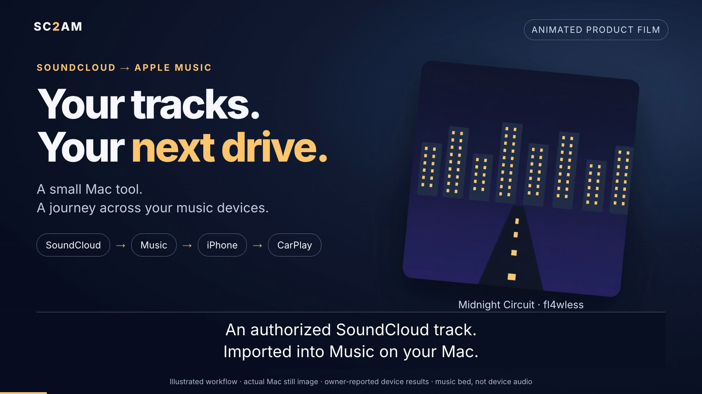

# SC2AM - SoundCloud to Apple Music Automation Tool

A Python CLI tool that automates downloading tracks from SoundCloud and importing them into Apple Music on macOS.

Overview
--------

SC2AM provides a small, repeatable workflow for importing SoundCloud tracks into your macOS Music library:

- Validate a SoundCloud track URL
- Download the audio using yt-dlp and convert/normalize to MP3
- Embed metadata (title, artist, album, genre, date) and cover artwork
- Open Music.app and import the tagged MP3
- Optionally add the track to a specified playlist

The downloaded MP3 files are automatically enriched with SoundCloud metadata (title, artist, album, genre, date) and cover artwork, with improved title and artist mapping so Apple Music shows the correct track information after import. Artwork is checked as image data and normalized to JPEG; the download result reports when a fallback image is used.

## See SC2AM in action

[](docs/demo/product-film/sc2am-product-film.mp4)

From a SoundCloud link to Apple Music, iPhone and CarPlay.
Watch the [36-second captioned overview](docs/demo/product-film/sc2am-product-film.mp4),
featuring a real Apple Music screenshot, animated scenes and a demo soundtrack.

[Setup, tested command and credits](docs/demo/product-film/README.md)

## Installation

### Requirements
- **macOS** (Apple Music integration requires macOS)
- **Python 3.10+**
- **yt-dlp** (will be installed as dependency)
- **FFmpeg and ffprobe** (required by yt-dlp to extract and convert MP3 audio)

### macOS Prerequisites

Apple Music automation relies on macOS permissions and Music.app being available locally. Before using SC2AM, make sure:

- **Music.app is installed** and can be opened manually on this Mac.
- **Music.app has been launched at least once** so the library is initialized.
- **Automation permission is allowed** for the app you run SC2AM from, such as Terminal, iTerm, VS Code, or PyCharm.
- **System Settings > Privacy & Security > Automation** allows that app to control Music.
- **The Music library is accessible** on the current macOS account you are using.

For a step-by-step checklist, see [`docs/macos-setup.md`](docs/macos-setup.md).
That guide also explains Apple Music Sync Library, manual Finder sync, offline
listening, and the iPhone/CarPlay path; SC2AM itself only confirms the local Mac
import.
Release preparation is documented in [`docs/releasing.md`](docs/releasing.md),
and user-facing changes are tracked in [`CHANGELOG.md`](CHANGELOG.md).

### End-user installation on macOS

This install path uses the verified `v2.0.1` GitHub wheel. It requires macOS,
Python 3.10 or newer, and Homebrew for the external `ffmpeg` and `ffprobe`
programs. Music.app is needed when importing tracks; a real download also needs
network access.

```bash
brew install ffmpeg
git clone https://github.com/zfl4wless/sc2am.git
cd sc2am
python3 -m venv .venv
source .venv/bin/activate
python -m pip install \
  "https://github.com/zFl4wless/sc2am/releases/download/v2.0.1/sc2am-2.0.1-py3-none-any.whl"
sc2am doctor
sc2am download "https://soundcloud.com/artist/track"
```

The wheel installs SC2AM and its Python dependencies into the active virtual
environment. Do not also install `requirements.txt`; it is a compatibility
wrapper around the same project dependencies. The `doctor` check reports
missing prerequisites before the first real download. For Music.app permissions,
see [macOS setup](docs/macos-setup.md).

To upgrade an existing installation from `v2.0.0` to the current `v2.0.1`,
activate the same environment and install the released wheel with `--upgrade`:

```bash
python -m pip install --upgrade \
  "https://github.com/zFl4wless/sc2am/releases/download/v2.0.1/sc2am-2.0.1-py3-none-any.whl"
python -m pip check
```

For later upgrades, use the wheel URL for the latest GitHub release; its version
is part of the asset filename and URL. The GitHub releases page is linked from
the project's [release notes](https://github.com/zFl4wless/sc2am/releases).

The application upgrade does not remove `~/.sc2am/config.yaml`, downloaded
tracks, or `<download_dir>/.sc2am/history.sqlite3`. If an old config contains
settings no longer recognized by this version, keep a backup, remove or correct
only those settings, and retry `sc2am doctor`. To regenerate defaults, first copy
the config file and then run `sc2am config init --force`; this replaces only the
selected YAML file. Never remove the download folder's `.sc2am` directory: it
contains the journal SC2AM uses to safely resume downloads and imports.

### Contributor setup

For development, clone the repository, create and activate a virtual environment,
and install the project with its development tools:

```bash
python3 -m venv .venv
source .venv/bin/activate
python -m pip install -e '.[dev]'
```

The editable install is for contributors who need changes in the checkout to be
available immediately. It is not an additional step for end users.

## Usage

### Quick Start

SoundCloud-Links must point to a single track, for example:
`https://soundcloud.com/artist/track`
or `https://www.soundcloud.com/artist/track`.
Mobile share links such as `https://on.soundcloud.com/<token>` are also accepted
by `download` and `batch`. SC2AM resolves them before validation and passes the
resolved track URL to the downloader. Resolution makes at most five HTTP HEAD
requests, with a 3-second connection and 5-second read timeout per request.
Redirects to unrelated hosts, loops, expired links, and collections are rejected;
use a fresh share link or a direct track URL if resolution fails. `--dry-run`
also needs a network connection for share links; direct URLs are validated locally.
Profiles, profile tabs (such as `/likes` or `/tracks`), albums, and sets are
rejected. SC2AM also checks the extracted result before downloading audio;
if it is a collection or cannot be verified as a single track, the download stops.

**Download a single track:**
```bash
sc2am download "https://soundcloud.com/artist/track"
```

**Download multiple tracks in one run:**
```bash
sc2am download \
  "https://soundcloud.com/artist/track1" \
  "https://soundcloud.com/artist/track2"
```

If you want to keep processing after one URL fails, use:
```bash
sc2am download \
  "https://soundcloud.com/artist/track1" \
  "https://soundcloud.com/artist/track2" \
  --continue-on-error
```

**Download and add to playlist:**
```bash
sc2am download "https://soundcloud.com/artist/track" --playlist "My Playlist"
```

If you do not pass `--playlist`, SC2AM uses the configured `default_playlist` when one is set. Playlist names are matched against the playlists currently available in Apple Music, and the app will tell you clearly if the playlist is missing or if the name is duplicated.

Names containing commas, quotes or Unicode characters are supported, for example
`--playlist "Road, Trip"`. Matching ignores case and surrounding whitespace;
the original name is preserved for the import. Choose a regular user playlist:
Smart, Genius, folder and system playlists cannot receive tracks. Duplicate
names must be renamed before importing, even when they occur in different folders.

**Don't automatically open Music app:**
```bash
sc2am download "https://soundcloud.com/artist/track" --no-open
```

For a preview that validates the input and shows the planned actions without
downloading files or accessing Music.app, add `--dry-run`. Use
`--no-open --playlist ""` when you want to disable both Music actions.

### Batch Processing

Create a file `urls.txt` with one URL per line:
```
https://soundcloud.com/artist/track1
https://soundcloud.com/artist/track2
# This is a comment
https://soundcloud.com/artist/track3
```

Then process all URLs:
```bash
sc2am batch urls.txt
```

**Batch options:**
```bash
# Add all tracks to a playlist
sc2am batch urls.txt --playlist "My Playlist"

# Continue processing even if a URL fails
sc2am batch urls.txt --continue-on-error
```

### Configuration

See the [CLI and configuration contract](docs/cli-and-config-contract.md) for the
complete interface. Precedence is explicit CLI options > environment > selected
YAML file > defaults. A custom YAML file replaces the default file. Invalid YAML,
unknown keys, and invalid values are reported instead of silently ignored.

SC2AM ignores external yt-dlp configuration files for both track information and
audio downloads (`--ignore-config`). Personal yt-dlp settings such as
`--skip-download`, download archives, and match filters do not affect SC2AM.
The SC2AM configuration precedence above remains unchanged.

**View current configuration:**
```bash
sc2am config show
```

**Configuration File** (`~/.sc2am/config.yaml`):
```yaml
download_dir: ~/Downloads/sc2am
default_playlist: null
open_music_app: true
continue_on_error: false
log_level: INFO
log_file: null
```

**Environment variables:**
Use exported variables or prefix the command with assignments. `.env` files are not
loaded automatically.

```bash
SC2AM_DOWNLOAD_DIR=~/Music/Downloads SC2AM_PLAYLIST="My Playlist" SC2AM_LOG_LEVEL=DEBUG \
  sc2am download "https://soundcloud.com/artist/track"
```

**Active settings:**

| Option | Type | Default | Description |
| --- | --- | --- | --- |
| `download_dir` | Path | `~/Downloads/sc2am` | MP3 destination |
| `default_playlist` | String or null | `null` | Default playlist |
| `open_music_app` | Bool | `true` | Automatically opens MP3s in Music |
| `continue_on_error` | Bool | `false` | Continues after an input/download failure |
| `log_level` | String | `INFO` | DEBUG, INFO, WARNING, ERROR, or CRITICAL |
| `log_file` | Path or null | `null` | Optional detailed log file |

Both `download` and `batch` support `--no-open` / `--open`,
`--continue-on-error` / `--stop-on-error`, `--playlist NAME`, and `--dry-run`.
Omitted options inherit configuration. `--playlist ""` disables the configured
playlist. `--no-open` leaves playlist actions enabled; use both to avoid Music
interaction. Dry runs validate and preview without downloads, file writes, or
Music actions.

### Global Options

```bash
# Use custom config file
sc2am --config /path/to/config.yaml download "..."

# Set log level
sc2am --log-level DEBUG download "..."
```

### Advanced Examples

**Batch download with logging:**
```bash
sc2am --log-level DEBUG batch urls.txt --continue-on-error
```

**Download to custom directory:**
```bash
SC2AM_DOWNLOAD_DIR=~/Music sc2am download "..."
```

## How It Works

1. **Validate** - Checks if the provided URL is from a supported platform
2. **Download** - Uses yt-dlp to download audio as MP3 (192kbps)
3. **Tag** - Embeds title, artist, album/genre/date and cover artwork into the MP3
4. **Import** - Confirms a library track reference in Apple Music
5. **Add** - (Optional) Reuses that track and confirms playlist membership via AppleScript

SC2AM retries transient download failures and read-only Music queries. Mutations
are confirmed against the active Music library before reporting success.

MP3 filenames include the SoundCloud track ID: `Title [123456789].mp3`.
Tracks with the same title and different IDs are saved separately. A local journal
in `<download_dir>/.sc2am/history.sqlite3` records source IDs, verified file hashes
and Music references. Repeating a recorded URL reuses the unchanged MP3 without
network extraction, download or retagging. A new URL resolving to the same source
ID also reuses it, even if the title changed. Missing files can be downloaded
again; changed files stop with an integrity warning. Legacy title-only files are
not migrated.

Music imports store a source marker in the MP3's default English ID3 comment
(preserving existing text) so copied library files can be found after a lost
response. Confirmed persistent IDs are scoped to the active library and checked
on every run. Existing playlist membership is reused. Keep the download folder
and its `.sc2am` journal together; safe repeat/resume is scoped to this folder.
Do not run concurrent imports from different download folders into one library.
Existing imports from older SC2AM versions can be recognized by their original
file location; copied legacy imports without a marker/history need manual review
before the first run. Confirmation covers the local library only, not cloud sync,
iPhone availability or playback.

SC2AM only tags and imports the verified MP3 path reported by that download.
Missing or invalid output paths cause a download error, even when other MP3s
already exist in the directory.

### Exit Codes and Logging Behavior

SC2AM now returns stable exit codes for scripting:

- `0` - command completed without input/download failures
- `1` - runtime/download failure or a run that continued past invalid entries
- `2` - usage/configuration error or an input-validation abort

Music import/playlist failures remain warnings and do not change exit status by
default. Add `--strict-import` to `download` or `batch` to return `1` for failed
or unconfirmed Music stages; use `--continue-on-error` to continue after them.
Summaries separate downloads, confirmed local imports and playlist memberships,
including partial success. Dry runs count previews only and perform no Music
steps. Local confirmation does not verify cloud/iPhone availability.

CLI progress output is written as clean status lines. By default, Python logger output on stderr is limited to warnings and errors so informational log lines do not duplicate the CLI status messages. Explicit `--log-level DEBUG` (or `log_level: DEBUG` / `SC2AM_LOG_LEVEL=DEBUG`) includes diagnostic and informational logs on stderr. To retain logs in a file, configure `log_file` or `SC2AM_LOG_FILE`.

### Batch Processing Output

When running batch operations with multiple links or URLs from a file, SC2AM provides improved logging and summary output to help you debug and understand the results:

- **Grouped logs** - Each track is clearly separated with visual dividers for easy scanning
- **Real-time status** - Per-track status updates show what SC2AM is doing (downloading, opening, adding to playlist)
- **Stage results** - Separate download, confirmed import and playlist counts preserve partial success
- **Failed track details** - If any tracks fail, the summary lists each failed URL with its specific error message

Example output with `--no-open --playlist "" --continue-on-error`:
```
──────────────────────────────────────────────
Track 1/3: Processing https://soundcloud.com/artist/track1
Track 1/3: Validating SoundCloud URL...
Track 1/3: OK: Valid SoundCloud URL
Track 1/3: Downloading track...
Track 1/3: OK: Downloaded: track1 [123456789].mp3
Track 1/3: Done!

──────────────────────────────────────────────
Track 2/3: Processing https://soundcloud.com/artist/track2
Track 2/3: Validating SoundCloud URL...
Track 2/3: OK: Valid SoundCloud URL
Track 2/3: Downloading track...
Track 2/3: ERROR: Track not found

──────────────────────────────────────────────
Track 3/3: Processing https://soundcloud.com/artist/track3
Track 3/3: Validating SoundCloud URL...
Track 3/3: OK: Valid SoundCloud URL
Track 3/3: Downloading track...
Track 3/3: OK: Downloaded: track3 [987654321].mp3
Track 3/3: Done!

Downloads: 2 succeeded, 1 failed (66% success rate)
Imports: not requested
Playlists: not requested

Failed tracks:
  1. https://soundcloud.com/artist/track2
     Error: Track not found
```

## Troubleshooting

### Diagnose an unexpected failure

No log file is created by default (`log_file: null`). Generic errors show how to
enable diagnostics; dependency, path, URL and Music permission errors include
remedies. To see debug output on stderr, replace the example link with the failing
track URL and keep the options from the original command:

```bash
sc2am --log-level DEBUG download "https://soundcloud.com/artist/track"
sc2am --log-level DEBUG batch urls.txt --continue-on-error
```

To save command details, underlying yt-dlp errors and exception tracebacks in a
diagnostic log, set a writable log path:

```bash
SC2AM_LOG_FILE="$PWD/sc2am-debug.log" sc2am --log-level DEBUG download "https://soundcloud.com/artist/track"
SC2AM_LOG_FILE="$PWD/sc2am-debug.log" sc2am --log-level DEBUG batch urls.txt --continue-on-error
```

Put global options before `download` or `batch`. If using a custom configuration,
keep `--config PATH` before the subcommand as well. When running from the source
checkout, replace `sc2am` with `python main.py`. A configured log file retains
underlying errors and exception tracebacks at the default INFO level too; DEBUG
adds command and progress context. These commands repeat the workflow, so check
the Music library and target playlist before retrying a failed or uncertain
import. Review logs for private URLs and local paths before sharing them.

`--dry-run` validates and previews only: it suppresses log-file writes and does
not reproduce download or Music failures. `config show` also does not write a
log file.

### yt-dlp not found
```bash
pip install yt-dlp --upgrade
```

### Apple Music not opening
- Ensure Music.app is installed (comes with macOS)
- Check your `open_music_app` setting in config
- Confirm the app you use to run SC2AM has Automation permission for Music in System Settings

### macOS permissions or prerequisites are missing
- Open Music.app once manually and confirm it launches without errors
- Go to **System Settings > Privacy & Security > Automation** and allow the app you use to run SC2AM to control Music
- If you previously denied access, re-run SC2AM after re-enabling the permission so macOS can prompt again if needed
- See [`docs/macos-setup.md`](docs/macos-setup.md) for the full checklist

### Adding to playlists fails
- Check the playlist name (matching ignores case and surrounding whitespace)
- Rename duplicate playlists and choose a regular user playlist rather than a Smart, Genius, folder or system playlist
- Ensure the Music.app is not currently playing (can interfere with AppleScript)

### Apple Music commands time out
- Each `osascript` attempt is limited to 30 seconds. Read-only lookups retry temporary failures and timeouts up to three attempts, with 1- and 2-second delays (at most about 93 seconds).
- Open Music.app and check for permission prompts or an unresponsive app.
- After a failed mutation SC2AM queries Music to reconcile a completed import or playlist addition. A pending journal record prevents replay if the result is still uncertain. Stopping the command does not undo a delivered event. Rerun the same command to reconcile; no new download is needed while the verified MP3 remains available.
- Music failures remain CLI warnings and retain the existing download-based summary and exit status. An unresolved mutation needs the [manual recovery procedure](docs/music-import-validation.md); do not delete the journal or blindly repeat imports.

### Permission denied on download
- Check that download directory exists and is writable:
```bash
mkdir -p ~/Downloads/sc2am
chmod 755 ~/Downloads/sc2am
```

## Contributing

Contributions are welcome! Please:

1. Fork the repository
2. Create a feature branch (`git checkout -b feature/my-feature`)
3. Make your changes
4. Submit a pull request

### Development Setup

```bash
# Install with dev dependencies
pip install -r requirements-dev.txt

# Code formatting
black --check .

# Linting
flake8 main.py sc2am tests scripts

# Tests
PYTHONPATH=. pytest -q
```

CI runs these checks for pull requests, `main`, and `v*` release tags. It also
builds sdist/wheel artifacts and checks the installed CLI in fresh environments
on Ubuntu and macOS, without a personal Apple account. See
[release validation](docs/releasing.md#automated-checks) for scope and limitations.

Dependency source of truth:
- `pyproject.toml` is the canonical dependency definition.
- `requirements.txt` and `requirements-dev.txt` are thin compatibility wrappers that install from project metadata.
- CI audits the resolved runtime dependencies declared in `pyproject.toml` with `pip-audit`; development tools are not included.

## License

MIT License - see LICENSE file for details

## Disclaimer

- This tool is for personal use to manage legally acquired music
- Respect copyright laws in your jurisdiction
- SoundCloud's terms of service should be respected

## Support

The current stable release line is 2.x. Older release lines are unsupported;
upgrade to the latest 2.x release before requesting help.

For general issues, feature requests, or questions:
- Check existing issues first, then open an issue on GitHub

For suspected security vulnerabilities, do not open a public issue. Report them
privately through [GitHub Security Advisories](SECURITY.md#reporting-a-vulnerability).
