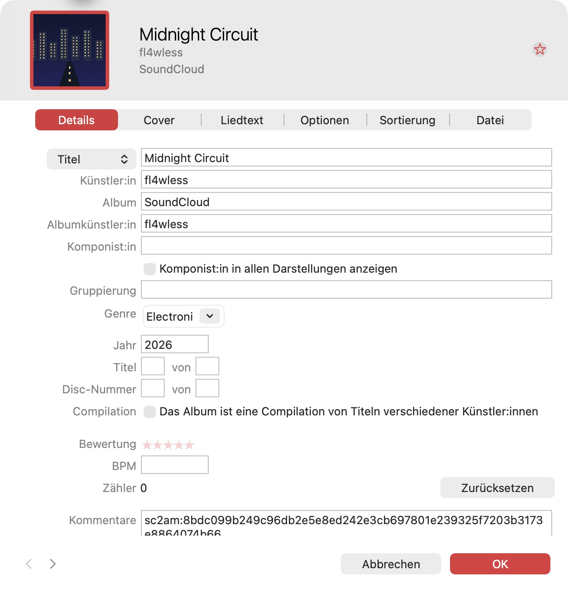
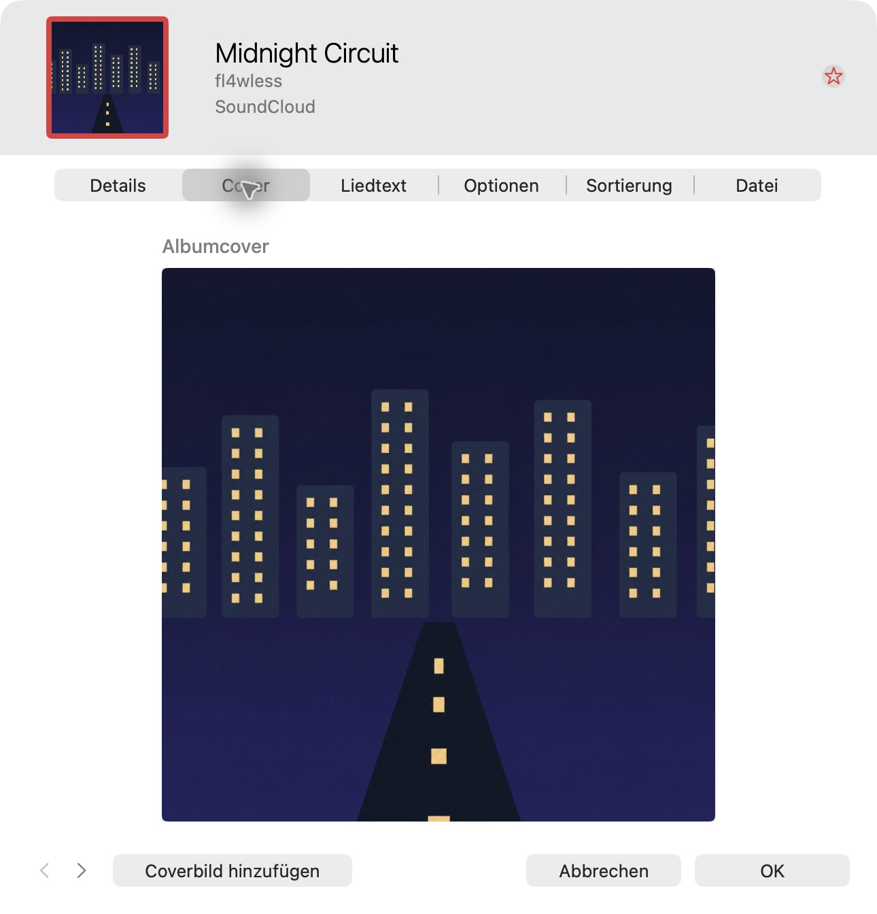
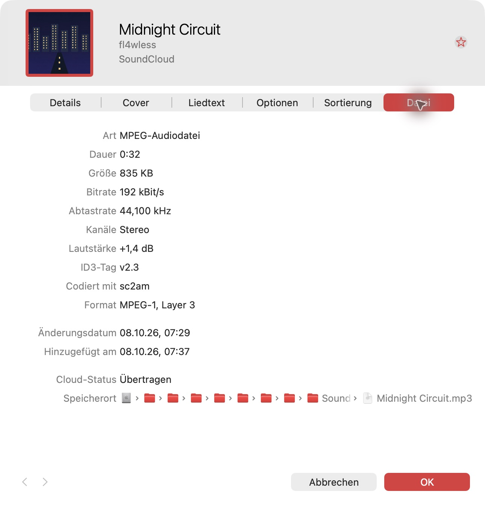

# Device acceptance record — 2026-10-08 (in progress)

Supports [issue #88](https://github.com/zFl4wless/sc2am/issues/88) and the
[manual acceptance checklist](../release-acceptance.md). This is a real local
run with screenshots and logs, **not an end-to-end demo video**. The full
release gate is **NOT TESTED**. No release or tag was created.

## Environment and authorization

| Field | Value |
| --- | --- |
| Tested commit | `c87126d7310a298b0e1e3756c2e448d7b5d4d06b` (documentation branch; functional code from main `2e5b469`) |
| Tester / date | Codex-assisted Mac observations; owner device details; 2026-10-08 |
| Mac / macOS / Music | Mac14,2 / 27.0 / 1.7 |
| Python / yt-dlp / FFmpeg | 3.14.8 / 2026.7.4 / 9.0.2 |
| iPhone / iOS / free space | Owner reports iPhone 13 / 27.0.1 / approximately 20 GB; not independently observed |
| Subscription / phone sync | Owner reports Apple Music subscription and iPhone Sync Library already enabled |
| CarPlay | Owner reports BMW with built-in wireless Apple CarPlay; exact vehicle model not supplied |
| Local library | Existing authorized SC2AM test library, ID `0EFDCF7D075BAF42`; isolated test media folder; Sync Library off |
| Download isolation | New dedicated demo directory, represented below by `<demo-root>`; custom config; inherited `SC2AM_*` removed |

The owner explicitly authorized the existing Mac test library and sanitized
public demo evidence, excluding the personal Mac library. It contained eight
older test tracks before this run; it was not empty and was not created under a
disposable macOS user. These exceptions are recorded, not marked as compliance
with the checklist's recommended empty/disposable setup.

After this local run, the owner expressly authorized a **new, initially empty**
Mac test library using the personal Apple Music account, uploading only
`Midnight Circuit`. Cloud library items may populate its view, but must not be
modified, recorded or published. This is not an isolated cloud account. The
existing local test library and its older fixtures must not be synchronized.
With owner assistance for Option-launch, the new `SC2AM Cloud Demo` library was
created in a dedicated temporary folder. Its Songs view was verified empty and
its media folder isolated, with copy-to-media enabled and automatic downloads
off. Only the demo track was imported before enabling its Sync Library checkbox
under the explicit permission above. No phone sync settings were changed.

## Source and attribution

[Midnight Circuit by fl4wless](https://soundcloud.com/fl4wless-167171478/midnight-circuit),
SoundCloud track ID `2415115401`: original algorithmic audio generated locally
from oscillators/noise, no external samples or music-generation service. Original
geometric cover edited with OpenAI ImageGen to remove text. The owner uploaded
the prepared source package for this test. Source hashes and provenance are
retained with the local package. The earlier ElevenMusic Free track is not used.

Proposed public credit: **Midnight Circuit — original algorithmic demo audio,
created with Codex assistance; original geometric artwork, edited with OpenAI
ImageGen.** Link the SoundCloud source and disclose the actual excerpt/MP3
conversion and video cuts in the final demo. No final video has been edited.

## Actual local commands and observations

From the repository root, the following CLI invocation ran with the repository
virtual environment first on PATH and inherited `SC2AM_*` variables removed.
Only the dedicated generated directory is replaced by `<demo-root>` below.
Config: `download_dir: <demo-root>/downloads`, `default_playlist: null`,
`open_music_app: true`, `continue_on_error: false`, `log_level: INFO`,
`log_file: null`.

```bash
.venv/bin/python main.py --config "<demo-root>/config.yaml" \
  download "https://soundcloud.com/fl4wless-167171478/midnight-circuit" \
  --open --playlist "" --stop-on-error --strict-import
```

Started at 05:29:18.763 UTC; finished at 05:29:23.235 UTC; elapsed 4.472 seconds;
exit code 0; stderr empty. These are measured total download/import times,
**not cloud synchronization times**. Actual stdout:

```text
Track: Validating SoundCloud URL...
Track: OK: Valid SoundCloud URL
Track: Downloading track...
Track: OK: Downloaded: Midnight Circuit [2415115401].mp3 (metadata embedded)
Track: Importing into Apple Music...
Track: OK: Import confirmed in Apple Music
Track: Done!
Downloads: 1 succeeded, 0 failed (100% success rate)
Imports: 1 confirmed, 0 failed/unconfirmed
Playlists: not requested
Music confirmation covers the local library only; cloud/iPhone availability is not verified.
```

The MP3 is 834,948 bytes, 44,100 Hz and 32.078 seconds. Mutagen confirmed title
`Midnight Circuit`, artist `fl4wless`, album `SoundCloud`, genre `Electronic`
and one embedded JPEG cover. Its SHA-256 after SC2AM's import marker was added:
`6b7a3af2e461ee8f7b49b6224d34aca62edb33313548b902d0b3f15b77308400`.
Music.app displayed the same tags and artwork. The journal recorded Music track
ID `891EE6C629AA2506` in the test library.





The same command then ran again with exit 0, empty stderr and
`Reused verified download: Midnight Circuit [2415115401].mp3`.
A UTF-8 file contained the same URL on two lines. Actual batch invocation:

```bash
.venv/bin/python main.py --config "<demo-root>/config.yaml" \
  batch "<demo-root>/repeated-urls.txt" \
  --open --playlist "" --stop-on-error --strict-import
```

Batch exit 0, empty stderr, two verified file reuses and two confirmed import
operations. After both checks, Music's Songs view filtered to `Midnight Circuit`
contained exactly one row. These confirmation counts describe operations, not
new tracks. The screenshots are still images; no terminal/Music video was
recorded, and no local playback was claimed.

## Actual authorized cloud upload

The same CLI download command imported the already verified MP3 into the new,
initially empty test library at 05:37:28.639 UTC (commit `27b4ec4`); exit 0,
empty stderr, 1.464 seconds. This reused the earlier SoundCloud download rather
than fetching it again. New library ID `15BE92BBC2B0C7C1`, local Music track ID
`DE16F0AE0B09FF8A`. The old fixture library was not synchronized.

The new library contained exactly one local track before sync was enabled.
The timing record started at 05:39:00.209 UTC immediately before applying the
Sync Library setting. Music showed `Upload erforderlich` / `Warten`, then
`Lokal` / `Übertragen` (Uploaded). The first observation of Uploaded was at
05:39:48.748 UTC, **48.539 seconds after the start**. This is a measured upper
bound to first observed completion; the actual upload may have finished earlier
between UI checks. It is not a measurement of iPhone appearance or instant sync.

The File pane independently displayed `Cloud-Status: Übertragen`. Its screenshot
contains only this demo track, not account details or other cloud items:



## Owner-observed iPhone results

Asked whether the track appeared with the correct cover, downloaded completely
and played audibly from a fresh start with Wi-Fi/cellular data disabled, the
owner replied **“Ja das klapt.”** This affirms those requested checks and is
recorded as owner-observed manual evidence, not an independent agent observation.
The exact first appearance time was requested but not supplied; no iPhone wait
duration is inferred. No phone screenshot/video has been supplied.

The owner is next checking real parked wireless CarPlay: correct track/cover,
advancing elapsed time and audible playback without internet. Wi-Fi/Bluetooth
remain on for the wireless connection and cellular data remain off; this differs
from the standalone phone offline setup. Apple's [wireless CarPlay guidance](https://support.apple.com/en-gb/105109)
requires Wi-Fi/Bluetooth. The subsequent owner result is recorded below.
No upload video or device footage has been recorded/supplied.

## Owner-observed CarPlay results

Asked whether real parked CarPlay displayed the correct track/cover, advanced
elapsed time and played audibly without internet, the owner replied:
**“Habe einen BMW mit built-in Apple Carplay. Klappt auch alles.”** This affirms
the requested checks on built-in wireless BMW CarPlay. It is owner-observed
manual evidence, not an independent agent observation. The exact BMW model,
test timestamps and raw CarPlay video were not supplied.

## Real missing-tool checks

Two actual CLI subprocesses used separate custom configs and controlled PATHs:
one with `yt-dlp` and `ffprobe` but no `ffmpeg`, one with `yt-dlp` and `ffmpeg`
but no `ffprobe`. This restricted only those subprocesses; no system tool or
permission was changed. Both used the actual demo URL with `--no-open`,
`--playlist ""`, `--stop-on-error`, `--strict-import` and a new download path.
Both exited 1 before download-directory creation or Music actions, with the
missing executable named and installation advice. Observed errors:

```text
ERROR: ffmpeg is not installed. Install it with 'brew install ffmpeg' and try again.
ERROR: ffprobe is not installed. Install it with 'brew install ffmpeg' and try again.
```

Each run reported `Imports: not requested` and `Playlists: not requested`.
These are real missing-tool checks, not a Music-permission-denial test.

## Acceptance results

| Scenario | Status | Evidence / notes |
| --- | --- | --- |
| MP3 title, artist and embedded artwork | PASS | Actual file inspection and screenshots above |
| Music confirms imported track in isolated Mac library | PASS | CLI confirmation, journal ID and UI details/artwork |
| Different tracks with the same title stay distinct | NOT TESTED | Only one source used in this run |
| Repeated URL reuses file without duplicate Music track | PASS | Repeat exit 0; cached-file message; one UI row afterward |
| Batch with repeated URL avoids duplicate track | PASS | Two-URL batch exit 0; one UI row afterward |
| Playlist with commas, quotes and Unicode | NOT TESTED | Playlist disabled for this run |
| Missing ffmpeg / ffprobe | PASS | Each absent from an actual per-process controlled PATH; exit 1, actionable error, no download directory or Music actions |
| Missing Music Automation permission | NOT TESTED | Existing permission allowed actual import |
| Interrupted network transfer and retry | NOT TESTED | No observed network interruption |
| Representative long track | NOT TESTED | The 32-second demo source does not establish long-track behavior |
| Cloud Matched/Uploaded and iPhone appearance | PASS | Agent observed Mac Uploaded after 48.539 seconds; owner confirms phone appearance with correct cover; exact phone appearance time/footage missing |
| iPhone download and playback with Wi-Fi/cellular off | PASS | Owner affirms completed download and audible fresh offline start; no independent agent observation or footage |
| Finder transfer and offline playback | N/A | Approved route is cloud; no Finder transfer claim |
| Real CarPlay and offline playback | PASS | Owner affirms requested real parked/offline checks on built-in wireless BMW CarPlay; exact model and footage not supplied |

## Next observations and release decision

1. Retain the verified new library and actual Uploaded evidence above; do not
   enable sync for the old fixture library or alter unrelated cloud items.
2. Retain the owner's phone report; the exact first appearance time is unknown
   and must not be replaced with the measured Mac upload duration.
3. Capture the actual iPhone finding/downloading the track, then restarting
   playback with Wi-Fi and cellular data disabled for the final demo. A report
   alone cannot replace its required video shot.
4. Capture the owner-confirmed parked CarPlay test: actual track selection,
   advancing elapsed time and audible offline playback, without adding a
   soundtrack over the evidence. Retain raw footage for caption editing.
5. Resolve the remaining required release scenarios with separate real evidence.
   The short demo and its local passes do not cover every release criterion.

To make the remaining source-dependent checks concrete, a second source was
prepared locally: an explicitly looped 20-minute derivative of our original
32-second audio, 192 kbit/s MP3, 28,801,682 bytes. Full FFmpeg decoding and
ffprobe's 1,200.000-second duration check passed. SHA-256:
`3c368c8d8e8de8e44daa3a46e26b18199503c70a7094311c3cef2dbb93fb6ebb`.
It is not a newly composed 20-minute song. Its provenance/cover accompany the
local asset. The owner must upload it as a **new** SoundCloud track with the
same `Midnight Circuit` title, clearly described as a looped software test, and
provide its new canonical URL. Do not overwrite the demo track or import this
extra source into the cloud-connected demo library. Long-track, same-title and
interruption/retry results remain NOT TESTED until real runs produce evidence.

**Overall gate: NOT TESTED.** iPhone passes above rely on the owner's actual test
responses, not merely device ownership or enabled sync. Five required scenarios
remain untested: same-title distinction, Unicode/quoted playlist, Automation
permission denial, interrupted transfer/retry and representative long track.
They still prevent a full release pass. The owner agreed to eventually combine
the planned patch/minor changes into v2.1.0 and document skipping v2.0.2; this
record does not authorize publication before acceptance, review and merge.
Issue #88's three demo acceptance criteria remain open. Roadmap #94 is unchanged.
